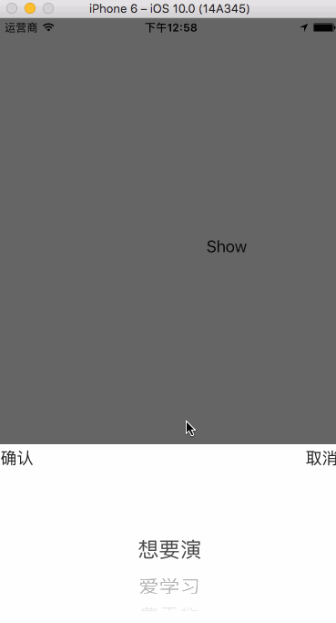

# NTPickerView
这是一个封装的UIPickerView，用于单项选择

* 使用方法
##### 1、导入NTPickerView.h和NTPickerView.m文件
##### 2、直接使用类方法

```
/*
 * 将实现细节封装为一个类方法
 *
 * @param view : 父视图
 * @param array : 数据源
 * @param confirmButtonAction : 点击确认按钮回调的方法
 * @param cancelButtonAction : 点击取消按钮回调的方法
 * @param maskClickAction : 点击背景回调的方法
 */

+ (void)showPickerViewAddedTo :(UIView *)view dataArray: (NSArray *)array
                confirmAction :(confirmButtonAction)confrimButtonAction
                 cancelAction :(cancelButtonAction)cancelButtonAction
                    maskClick :(maskClickAction)maskClickAction;

```

* 效果展示


